# PhosGB

An experimental Gameboy and Gameboy Color Emulator written in modern C++

<p align="center">
  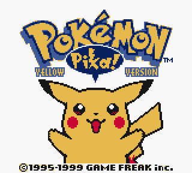
  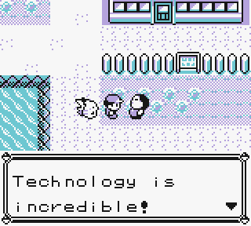
</p>
<p align="center">
  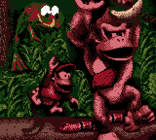
  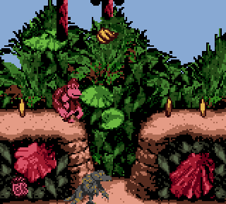
</p>
<p align="center">
  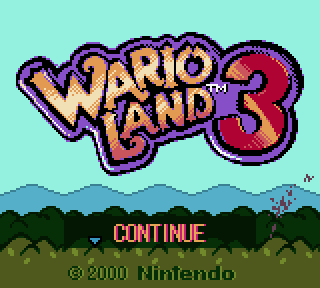
  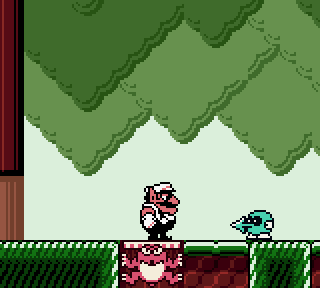
</p>
<p align="center">
  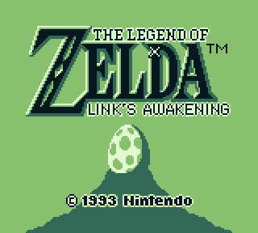
  
</p>
<p align="center">
  
  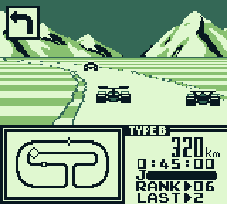
</p>
<p align="center">
  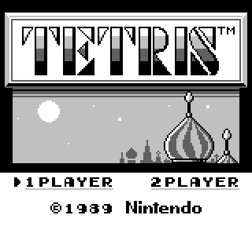
  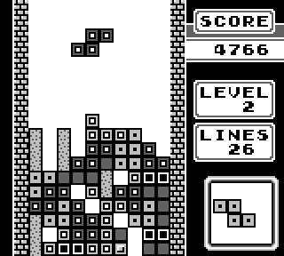
</p>
<p align="center">
  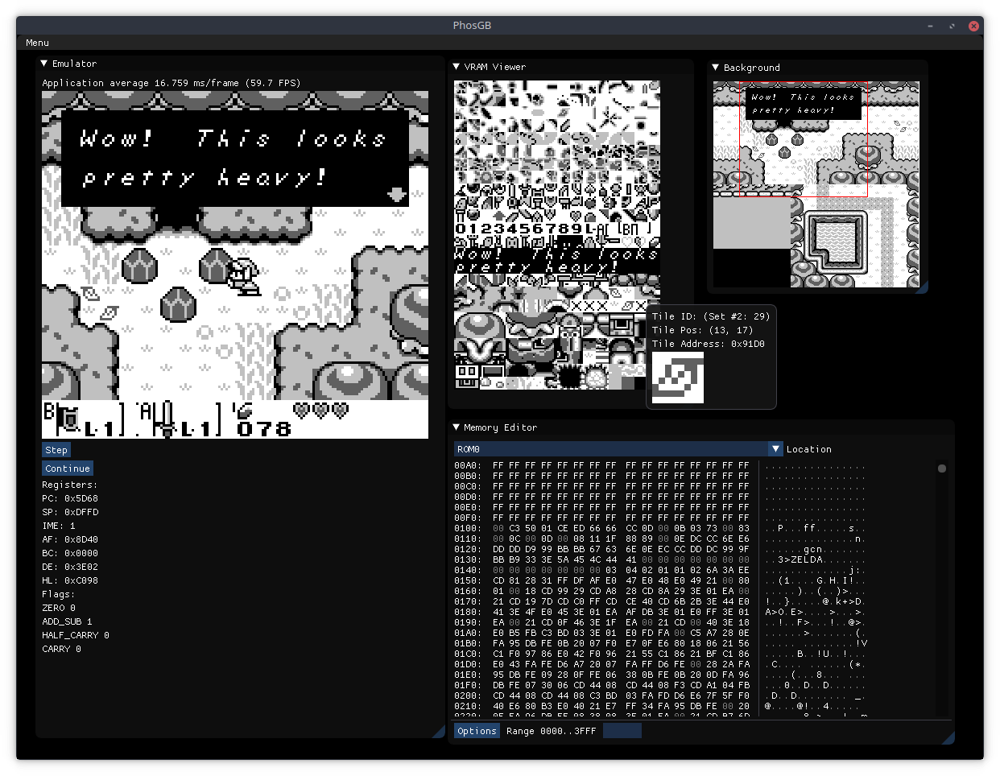
</p>

## Features

* WIP Gameboy Color support

* Support for MBC1, MBC2, MBC3 and MBC5 cartridges

* Full audio emulation

* Save States & Fast Forward

* Screenshots

* Saves SRAM to file

* Debugger with Memory Editor, Tileset & Background Viewer, etc.

* Custom palette for DMG mode

### Input

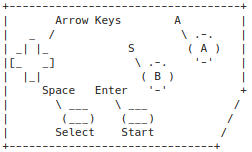

| Key           | Function      |
| ------------- |:-------------:|
| ```G```       | Toggle Debug Mode |
|```H```|Pause|
| ```F```      | Fast Forward      |
| ```F5``` | Save State      |
| ```F6```| Load State |
|```M```| Change Frame-Timer Mode |

**Right-Click** opens the main menu in Normal Mode.


## Building

PhosGB currently supports Windows, Linux and macOS. The frontend requires SDL2.

### Linux

Install SDL2 through your package manager, e.g. ```apt install libsdl2-dev```

``` mkdir build && cd build ```

``` cmake -DCMAKE_BUILD_TYPE=Release .. && cmake --build . --target phos -j 2 ```

### Windows

TODO

### macOS

``` brew install sdl2 cmake ```

``` mkdir build && cd build ```

``` cmake -DCMAKE_BUILD_TYPE=Release .. && cmake --build . --target phos -j 2 ```

## Accuracy

TODO


