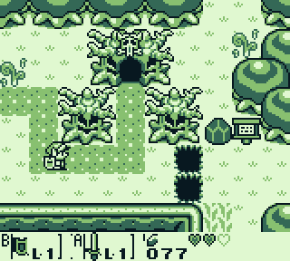
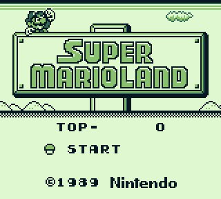
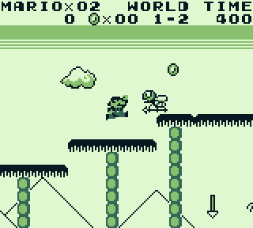
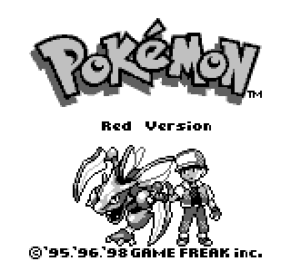
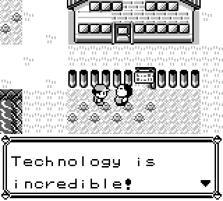

# PhosGB

An experimental Gameboy and Gameboy Color Emulator written in modern C++

<p align="center">
  
  
</p>
<p align="center">
  
  
</p>
<p align="center">
  
  
</p>
<p align="center">
  
  
</p>
<p align="center">
  
  
</p>
<p align="center">
  
</p>

## Features

TODO

## Building

PhosGB currently supports Windows, Linux and macOS. The frontend requires SDL2.

### Linux

Install SDL2 through your package manager, e.g. ```apt install libsdl2-dev```

``` mkdir build && cd build ```

``` cmake -DCMAKE_BUILD_TYPE=Release .. && cmake --build . --target phos -j 2 ```

### Windows

TODO

### macOS

``` brew install sdl2 cmake ```

``` mkdir build && cd build ```

``` cmake -DCMAKE_BUILD_TYPE=Release .. && cmake --build . --target phos -j 2 ```

## Accuracy

TODO


